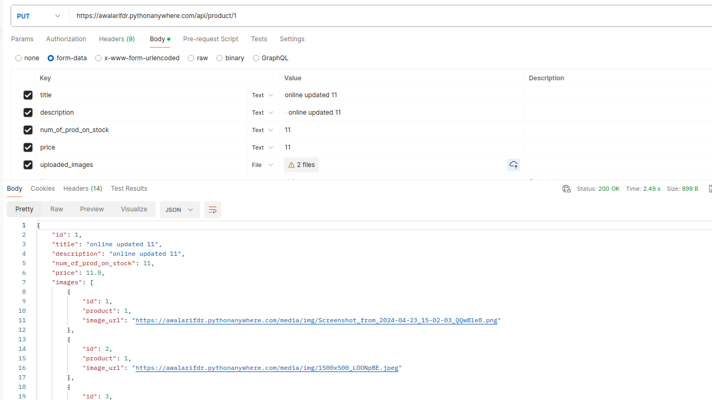

# API Endpoint for Ecommerce's product GET,	POST,	PUT,	DELETE

Base_URL : https://awalarifdr.pythonanywhere.com

# GET

1.  For all products url => Base_URL/api/products

2.  For a single product url => Base_URL/api/product/product_id

# POST

1. url =>Base_URL/api/products

No authentication required for now. You can send data to the server. for posting data, add the data on requests body as form-data
fill the title / description / num_of_prod_on_stock / price / uploaded_images -> ( this is a list field you can upload multiple images / single image And all the fields are required.

For Example:

# UPDATE

1.  url => Base_URL/api/product/id_of_item

For updating any product put changed data on request body as form-data fill the title/description/num_of_prod_on_stock/price/uploaded_images,
 all the fields are optional send request as  PUT. 

Like the Image below:

# Delete

1.  url => Base_URL/api/product/delete/id_of_item

For deleting any item give the id of product on url and hit send as a DELETE request. 
